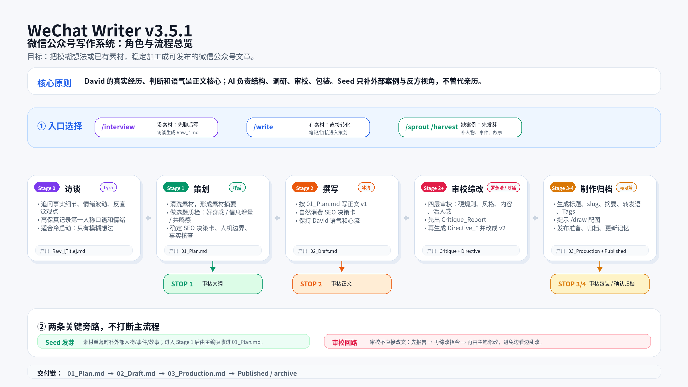
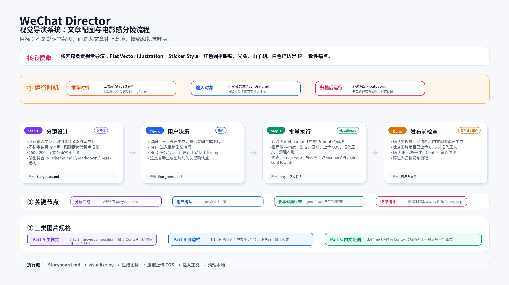

# WeChat Writing Team

微信公众号写作 + 视觉导演全套 Skill。对接 Claude Code / Codex / Gemini CLI，让 AI 帮你从访谈挖掘到配图生成，全流程跑通。

---

## WeChat Writer（写作 Skill）

写作流水线 Skill，支持 `/interview`（访谈挖掘）、`/write`（素材转化）、`/sprout`（外部素材发芽）和 `/harvest`（批量发芽）。

适用于从空白想法到发布成文的完整流程。



**核心功能：**
- `/interview` — 苏格拉底式访谈挖掘，生成高保真访谈录
- `/write` — 将素材快速转化为结构化文章
- `/sprout` — 将外部人物/事件/故事补入素材库
- 内置 SEO 关键词调研（可搭配 `wechat-index-query` 使用）
- 四轮审校：L1 硬规则 → L2 风格一致性 → L3 内容成立度 → L4 老友感终审

**目录结构：**
```
skills/wechat-writer/
├── SKILL.md                        # 主入口（Skill 触发点）
├── scripts/
│   ├── config_check.py             # ⭐ 首次使用前运行，检测环境配置
│   ├── cleaner.py                  # 素材清洗
│   ├── research.py                 # 事实核查
│   ├── review_toolkit.py           # 四轮审校
│   └── archive.py                  # 发布归档
├── references/
│   ├── core_personas.md            # 5 大核心角色定义
│   ├── routine_sprout.md           # 发芽流程规范
│   ├── template_01_plan.md          # 大纲模板
│   └── io_schema.md                # I/O 规范
└── knowledge/
    ├── style_guide_david.md        # 👤 写作风格（需替换为你的风格）
    ├── team_memory.md              # 👤 写作偏好（需按需更新）
    ├── ai_smell_guide.md           # 去 AI 味审校清单
    ├── wechat_index_keywords.md    # SEO 关键词积累库
    └── published_article_index.md  # 👤 文章索引（需替换为你的文章）
```

---

## WeChat Director（配图 Skill）

视觉导演 Skill，对接 `/draw`（配图生成），由"张艺谋"角色驱动，为文章设计电影感分镜。

适用于文章配图生成，支持 Gemini / GPT-Image2 API。



**核心功能：**
- `/draw` — 阅读文章草稿，设计 Storyboard 分镜表
- 支持 Gemini / GPT-Image2 API（可选）
- 批量生成：封面、侧边栏、内文配图
- 内嵌 TinyPNG 压缩 + 腾讯云 COS 上传（可选）

**目录结构：**
```
skills/wechat-director/
├── SKILL.md                        # 主入口
├── scripts/
│   └── config_check.py             # ⭐ 首次使用前运行，检测生图配置
├── references/
│   └── io_schema.md                # I/O 规范
└── assets/
    └── IP_Reference.png             # IP 形象参考图
```

---

## 快速开始

### 1. 安装

把这些文件放入你的 Claude Code / Codex / Gemini CLI 工作区。SKILL.md 会被自动识别为 Skill 入口。

### 2. 首次配置（推荐先运行）

```bash
python3 skills/wechat-writer/scripts/config_check.py   # 检测写作环境
python3 skills/wechat-director/scripts/config_check.py  # 检测生图配置
```

### 3. 写作（WeChat Writer）

```
/interview [话题]    # 访谈模式，从零挖掘素材
/write [标题]        # 素材模式，已有素材直接写稿
/write [标题] --from-stage N  # 从任意阶段继续
```

### 4. 配图（WeChat Director）

```
/draw                # 输入 Storyboard.md 路径，自动生成分镜
```

### 5. SEO 关键词调研（可选）

安装 [`wechat-index-query`](https://github.com/mileson/wechat-index-query) Skill（仅支持 macOS，需手动打开微信指数小程序），在策划阶段查微信指数找上升搜索词。

---

## 配置说明

生图需要配置 API key（Gemini 或 GPT-Image2），写入 `conductor/api_keys.json`：

```json
{
  "gemini": {
    "base_url": "https://generativelanguage.googleapis.com",
    "model": "gemini-3.1-flash-image-preview",
    "api_key": "your-key-here"
  },
  "gpt-image2": {
    "base_url": "https://api.openai.com/v1",
    "model": "gpt-image-2",
    "api_key": "your-key-here"
  }
}
```

TinyPNG 压缩和腾讯云 COS 上传为可选功能。

---

## ⚠️ 需要用户个人化的文件

以下文件位于 `knowledge/` 目录，克隆后建议按需替换：

| 文件 | 说明 |
|------|------|
| `style_guide_david.md` | 写作风格指南（示例为 David 的个人文风，需替换为你自己的风格） |
| `team_memory.md` | 团队记忆与踩坑记录（示例内容，需更新为你的偏好） |
| `published_article_index.md` | 已发布文章索引（示例内容，需替换为你自己的文章列表） |

---

## 依赖

- Python 3.8+
- Pillow（图片处理，可选）
- qcloud-cos-python-sdk-v5（腾讯云上传，可选）
- Obsidian CLI（archive 功能需要，可选）

---

## License

MIT