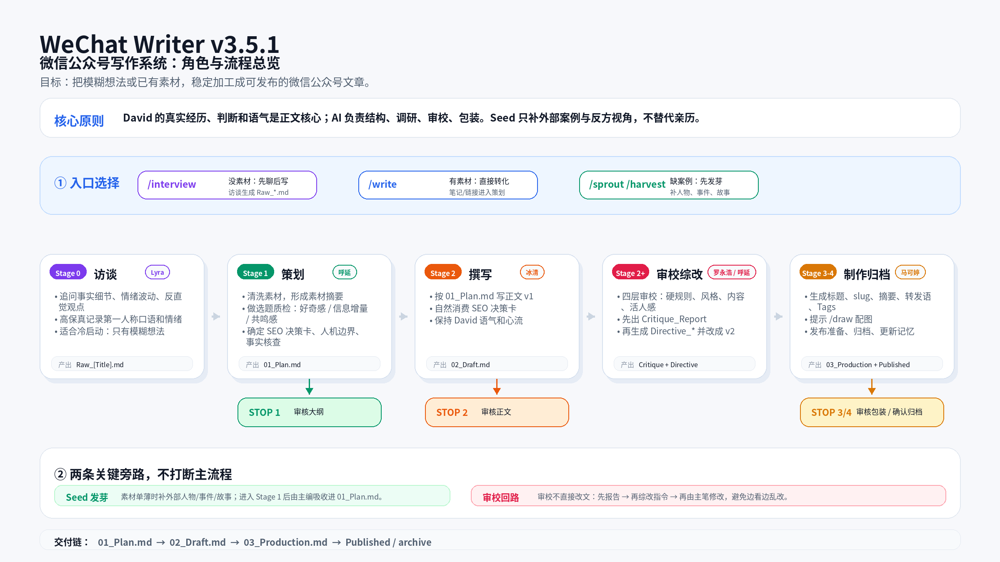
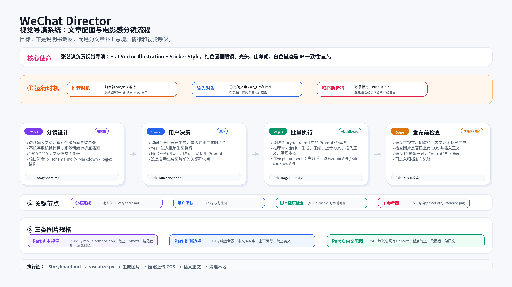

# WeChat Writing Team

[](https://github.com/DavidLam-oss/obsidian-wechat-converter) [Obsidian 微信发布插件](https://github.com/DavidLam-oss/obsidian-wechat-converter) — 写完文章后一键发送到微信公众号草稿箱

微信公众号**写作 + 视觉导演 + 素材采集**全套 Skill。对接 Claude Code / Codex / Gemini CLI，让 AI 帮你从访谈挖掘、素材发芽、配图生成一路跑到归档发布。

> **首次使用请先读 [`用户手册.md`](用户手册.md)** —— 里面写了工作区怎么建、每一步产出什么、常见问题怎么排查。

---

## 三个技能

| 技能 | 入口 | 做什么 |
|:--|:--|:--|
| **wechat-writer** | `/interview` `/write` `/sprout` `/harvest` | 写作流水线：访谈挖掘 → 策划 → 撰写 → 四轮审校 → 包装 → 归档 |
| **wechat-director** | `/draw` | 视觉导演：读定稿设计分镜（默认电影感 + 认知草图双镜头）→ 批量生图 → 注入正文 → 拼接封面 |
| **wechat-official-batch-download** | — | 素材采集：批量下载公众号文章，保留 HTML / Markdown / 图片 / 元数据，构建可追溯语料库 |





---

## 目录结构

```
.
├── README.md                  # 本文件（入门引导）
├── 用户手册.md                 # 完整手册：工作区结构 / 全流程 / 脚本速查 / FAQ
├── assets/                    # 工作流示意图
└── skills/
    ├── wechat-writer/
    │   ├── SKILL.md           # 主入口（Skill 触发点）
    │   ├── agents/            # Codex 适配（openai.yaml）
    │   ├── scripts/           # 全部纯标准库实现
    │   │   ├── workspace.py         # ⭐ 工作区根解析（跨平台）
    │   │   ├── config_check.py      # ⭐ 首次使用前运行：环境检测
    │   │   ├── console_encoding.py  # Windows 控制台编码兜底
    │   │   ├── cleaner.py           # 素材清洗
    │   │   ├── research.py          # 事实核查
    │   │   ├── review_toolkit.py    # 四轮审校 + 综改指令
    │   │   ├── article_assets.py    # 稿件图片引用解析与可移植复制
    │   │   ├── archive.py           # 归档 + 图片复制 + 索引更新
    │   │   ├── material_store.py    # 素材 / Seed 落盘（需用户确认）
    │   │   └── memory_store.py      # 团队记忆写入（需用户确认）
    │   ├── references/         # 角色人设 / 流程规范 / 模板 / IO 规范
    │   ├── knowledge/          # 随技能分发的规则与模板（个人数据请放工作区）
    │   └── tests/              # 回归测试（unittest）
    ├── wechat-director/
    │   ├── SKILL.md
    │   ├── agents/
    │   ├── assets/IP_Reference.png  # IP 参考图
    │   ├── scripts/           # 已按职责拆分（visualize 为 CLI 入口）
    │   │   ├── visualize.py         # 生图 / 压缩 / 上传 COS / 注入 编排
    │   │   ├── director_core.py     # 基础设施：常量表 / 路径解析 / 配置
    │   │   ├── brief_parser.py      # Storyboard 解析
    │   │   ├── workspace.py         # 工作区根解析
    │   │   ├── config_check.py      # 环境与渠道检测
    │   │   ├── validate_images.py   # Agent/平台出图后的交付验收
    │   │   ├── image_validation.py  # 图片规格单一来源
    │   │   ├── obsidian_bridge.py   # Obsidian CLI 桥接（可选）
    │   │   └── providers/           # gemini / gpt_image2 适配器
    │   ├── references/
    │   └── tests/              # 32 条行为护栏
    └── wechat-official-batch-download/
        ├── SKILL.md
        ├── agents/
        ├── references/        # SOP / 便携用法 / 工具对比
        └── scripts/           # 下载器 + HTML/Markdown 导出
```

---

## 快速开始

### 1. 安装

把 `skills/` 下的技能文件夹放进你的 Claude Code / Codex / Gemini CLI 技能目录（例如 `~/.claude/skills/`、`~/.codex/skills/`）。
`SKILL.md` 会被自动识别为 Skill 入口。

> 技能被安装到任何位置都能正常工作：脚本按**技能自身目录**解析自己的资源，文章工作区则按**结构标记**自动定位，不依赖机器绝对路径。

### 2. 建一个工作区

工作区就是你的写作目录。用 Obsidian 库根目录，或任意空目录，让它满足：

```
<workspace>/
├── articles/          # 写作项目（每个标题一个 Project_[Title]/）
├── published/         # 归档成品
├── conductor/         # 运行数据：api_keys.json、发布索引、待确认记忆
└── knowledge/         # 你的真实风格 / 素材库 / 团队记忆（从技能模板初始化）
```

`articles/` + `published/` 这两个目录就是工作区的**结构标记**，脚本靠它定位工作区。
（如果你的写作目录本身是 Obsidian 库，直接含 `.obsidian/` 也能被识别。）

### 3. 首次配置检测（推荐先跑）

```bash
python3 skills/wechat-writer/scripts/config_check.py --workspace <你的工作区>
python3 skills/wechat-director/scripts/config_check.py --workspace <你的工作区>
```

### 4. 写作（wechat-writer）

```
/interview [话题]              # 访谈模式，从零挖掘素材
/write [标题]                  # 素材模式，已有素材直接写稿
/write [标题] --from-stage N   # 从任意阶段继续
```

### 5. 配图（wechat-director）

文本定稿后：

```
/draw                          # 读取项目内的 Storyboard.md，设计分镜并配图
```

`/draw` **每次都会重新检测可用渠道并要求你显式选择**，不会用默认值替你做决定。查看当前可用渠道：

```bash
python3 skills/wechat-director/scripts/visualize.py --list-providers --workspace <你的工作区>
```

### 6. 素材采集（可选）

`wechat-official-batch-download` 用于批量抓取公众号文章作为写作参考，见其 `SKILL.md` 与 `references/`。

---

## 配置说明

生图需要配置 API key（Gemini / GPT-Image-2 / 其他兼容 OpenAI 协议的服务），写入 **工作区** 的 `conductor/api_keys.json`：

```json
{
  "gemini": {
    "base_url": "https://generativelanguage.googleapis.com",
    "model": "gemini-2.0-flash-exp-image-generation",
    "api_key": "your-key-here"
  },
  "gpt-image2": {
    "base_url": "https://api.openai.com/v1",
    "model": "gpt-image-2",
    "api_key": "your-key-here"
  }
}
```

TinyPNG 压缩（`tinify.api_key`）和腾讯云 COS 上传（`cos.*`）为**可选**功能，不配也能正常出图，只是不会自动压缩 / 上传。

---

## 需要你个人化的文件

技能 `knowledge/` 里放的是**规则与模板**；你自己的风格、素材、记忆请放在**工作区 `knowledge/`**。首次确认工作区后，把需要的模板复制过去即可（只补缺失文件，不覆盖已有内容）：

| 文件 | 说明 |
|:--|:--|
| `account_positioning.md` | 账号定位卡（**随仓库分发的是模板**，需替换方括号占位内容） |
| `style_guide_david.md` | 写作风格指南（示例为你自己的文风，建议替换） |
| `team_memory.md` | 团队记忆与踩坑记录（建议按需更新） |
| `published_article_index.md` | 已发布文章索引（运行时由 `archive.py` 维护在工作区 `conductor/`） |
| `素材库.md` | 私有灵感、金句、碎片观察 |
| `seeds/` | 已证明可复用的长期 Seed |

---

## 跨平台说明（macOS / Windows / Linux）

- **路径**：脚本不使用任何机器绝对路径。技能资源以技能自身目录为基准；文章工作区按 `--workspace` > `WECHAT_WORKSPACE` > 结构标记的顺序解析。
- **编码**：所有脚本通过 `console_encoding.py` 把 stdout/stderr 切到 UTF-8（`errors="replace"`），避免 Windows GBK 控制台在打印中文时崩溃。
- **换行**：仓库内文本文件统一 LF；仅 `wechat-official-batch-download/scripts/install-skill.ps1` 保持 CRLF 以适配 PowerShell。
- **依赖**：Python 3.10+；`wechat-director` 的封面拼接与图片验收需要 Pillow。
- **环境变量**：`WECHAT_WORKSPACE` 可指定默认工作区根。

---

## 依赖

- Python 3.10+
- Pillow（图片拼接与验收，wechat-director 需要）
- tinify（TinyPNG 压缩，可选）
- qcloud-cos-python-sdk-v5（腾讯云上传，可选）
- Obsidian CLI（给草稿写属性 / 打开预览，可选）
- bun + `vendor/baoyu-danger-gemini-web`（`--provider gemini-web` 需要，可选）

---

## License

MIT
